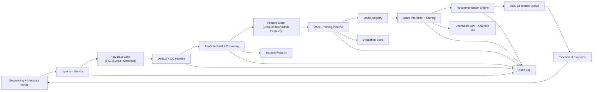

# Production Architecture for iPSC Two-Stage Perturbation Platform

## Scope and Goals

This document defines a practical production architecture for a small scientific software team operating a two-stage iPSC perturbation digital twin platform.

Primary goals:
- Support multiple experiments over time.
- Manage versioned AnnData datasets.
- Automate QC and demultiplexing.
- Track barcodes and clones longitudinally.
- Manage treatment libraries and revisions.
- Operate a model registry with retraining and evaluation.
- Enable active learning DOE recommendations.
- Produce dashboard-ready outputs.
- Maintain an audit trail and reproducibility.

Non-goals:
- Clinical validation claims.
- Regulatory positioning beyond internal scientific software operations.

## System Architecture

## Core Components

### 1. Ingestion Layer
- Accepts sequencing runs, sample sheets, treatment annotations, experiment manifests.
- Validates schema and required metadata before pipeline trigger.
- Generates immutable ingestion events and run IDs.

### 2. Data Processing Layer
- Demultiplexing stage (sample hash/HTO, optional clone/barcode decoding).
- QC stage (cell- and feature-level thresholds, run diagnostics, contamination flags).
- AnnData assembly stage with standardized obs/var/uns conventions.

### 3. Registry Layer
- Dataset registry: versioned AnnData artifacts and lineage links.
- Treatment library registry: treatment definitions, concentrations, aliases, status.
- Model registry: model binaries, parameters, training dataset references, metrics, approval status.

### 4. Modeling + Recommendation Layer
- Baseline + advanced perturbation models (RegenAI-PT adapters later).
- Trajectory and phenotype scoring stack.
- Recommendation policy (ranked treatment sequences, risk penalties, exploration bonuses).

### RegenAI-PT Forward Transition Model
- Purpose: learn `current expression/state + treatment + dose + covariates -> future expression/state`.
- This model is the **forward simulator** used by inverse recommendation.
- Supported usage patterns:
  - `intermediate + round1_treatment -> post_round1`
  - `post_round1 + round2_treatment -> post_round2`
  - sequential simulation `A -> B`
- Core architecture:
  - encoder for basal latent state
  - treatment embedding
  - treatment-specific dose-response scaling
  - covariate embeddings
  - decoder back to expression
  - adversarial heads to reduce treatment/covariate leakage in the basal latent state
- Recommendation flow:
  - simulate candidate treatments with the forward model
  - compare predicted future state to a requested target state
  - rank candidates by target-state closeness, penalties, and uncertainty
- Constraints:
  - research-grade scientific model, not an official CPA release
  - population-level transition learning because scRNA-seq is destructive
  - requires prospective experimental validation

### 5. Serving + Analytics Layer
- Batch scoring outputs to analytics DB.
- Dashboard-ready tables and API endpoints.
- Standard report exports (CSV/Markdown/JSON snapshots).

### 6. Governance Layer
- Audit trail (who/what/when/which input version).
- Reproducibility manifests (code commit, config hash, dataset version, environment).

## Data Model Tables (Logical)

### `experiments`
- `experiment_id` (PK)
- `name`
- `objective`
- `owner`
- `created_at`
- `status`

### `runs`
- `run_id` (PK)
- `experiment_id` (FK)
- `sequencing_run`
- `pipeline_version`
- `started_at`
- `ended_at`
- `status`

### `datasets`
- `dataset_id` (PK)
- `experiment_id` (FK)
- `run_id` (FK)
- `anndata_uri`
- `dataset_version`
- `parent_dataset_version`
- `schema_version`
- `created_at`

### `cells` (materialized/partitioned, not necessarily fully row-stored in OLTP)
- `dataset_id` (FK)
- `cell_id`
- `sample_id`
- `iPSC_line`
- `barcode_id`
- `clone_id`
- `time_point`
- `round`
- `round1_treatment`
- `round2_treatment`
- `treatment_sequence`
- `qc_pass`
- `cluster`
- `stage_label`
- `pseudotime`
- `fate_probability`

### `treatment_library`
- `treatment_id` (PK)
- `name`
- `target_pathway`
- `vendor`
- `dose_units`
- `active_flag`
- `library_version`

### `models`
- `model_id` (PK)
- `model_name`
- `model_type`
- `code_version`
- `training_dataset_id`
- `hyperparams_json`
- `registered_at`
- `status`

### `model_evaluations`
- `evaluation_id` (PK)
- `model_id` (FK)
- `dataset_id` (FK)
- `metric_name`
- `metric_value`
- `slice_key`
- `evaluated_at`

### `recommendations`
- `recommendation_id` (PK)
- `experiment_id` (FK)
- `model_id` (FK)
- `dataset_id` (FK)
- `treatment_sequence`
- `score`
- `rank`
- `risk_flags`
- `generated_at`

### `audit_events`
- `event_id` (PK)
- `event_type`
- `actor`
- `resource_type`
- `resource_id`
- `payload_json`
- `timestamp`

## Pipeline Stages

1. Intake + metadata validation.
2. Demultiplexing and barcode assignment.
3. QC metrics + filtering policy application.
4. AnnData build and dataset version registration.
5. Feature derivation (marker scores, trajectory features, clone statistics).
6. Model training/retraining (baseline and advanced models).
7. Evaluation and gating.
8. Recommendation generation.
9. Export to dashboard tables and reports.
10. Audit logging and run finalization.

## Model Lifecycle

1. Candidate model created from a tracked training job.
2. Validation against holdout and slice-specific benchmarks.
3. Registration in model registry with artifact + metadata.
4. Promotion states: `candidate` -> `staging` -> `production`.
5. Scheduled monitoring on drift/performance.
6. Rollback path to previous approved model.

Minimum registry metadata:
- training dataset version
- code commit hash
- feature schema version
- config hash
- metrics summary
- known limitations

## Validation Strategy

### Data Validation
- Schema checks at ingestion and pre-training.
- Metadata completeness checks for treatment/time-point/line/barcode fields.
- Value-range checks for QC, trajectory, and outcome fields.

### Model Validation
- Split strategy:
  - holdout by treatment
  - holdout by iPSC line
  - temporal holdout by experiment date when possible
- Required metrics:
  - score calibration error
  - ranking consistency (top-k overlap)
  - MAE/RMSE on condition-level outcomes
- Safety checks:
  - over-penalize high stress/off-target/clone skew conditions
  - conservative fallback when uncertainty is high

### Reproducibility Validation
- Re-run selected training jobs from manifests.
- Verify artifact hash and metrics parity within tolerance.

## Active Learning DOE Loop

1. Generate candidate treatment sequences from library constraints.
2. Score exploitation objective (predicted benefit).
3. Score exploration objective (uncertainty/diversity/coverage gaps).
4. Combine into acquisition score with configurable weights.
5. Propose DOE batch with constraints:
   - budget/plate capacity
   - clone/line balance
   - replicate requirements
6. Execute experiments and ingest results.
7. Retrain and reassess model performance.

Practical starting policy:
- 70% exploitation, 30% exploration.
- Hard exclusion for high-risk flags.

## Deployment Options

### Option A: Single-cloud managed stack (recommended for small team)
- Object storage for data lake/artifacts.
- Managed workflow orchestrator.
- Managed relational DB for registries/audit.
- Containerized training and batch inference.
- Lightweight API service for dashboards.

### Option B: Hybrid research + production bridge
- Research notebooks on secure compute.
- Productionized pipelines triggered from curated manifests.
- Strict artifact boundary between research and production stores.

## Risks and Mitigations

### Data drift across experiments
- Mitigation: drift dashboards, per-experiment calibration, periodic retraining.

### Metadata inconsistency
- Mitigation: strict schemas, ingestion blocking on critical missing fields, controlled vocabularies.

### Overfitting to specific lines/treatments
- Mitigation: holdout-by-line/treatment validation and slice reporting.

### Operational fragility for small team
- Mitigation: favor managed services, strong observability, minimal custom infra.

### Interpretability concerns
- Mitigation: include decomposed score components and risk flags in all recommendation outputs.

## Research-Grade vs Production-Grade Boundaries

### Still Research-Grade
- Novel trajectory/fate modeling assumptions.
- RegenAI-PT deep perturbation models prior to repeated external validation.
- Active learning acquisition tuning beyond baseline heuristics.

### Production-Grade Candidate
- Data ingestion, schema enforcement, and versioned dataset registry.
- Baseline model training/evaluation/registry workflows.
- Recommendation report generation with auditable provenance.
- Dashboard-ready aggregate outputs and monitoring hooks.

## Implementation Roadmap (Small Team)

Phase 1 (4-6 weeks):
- Dataset registry, treatment registry, audit events.
- Automated ingestion/QC/AnnData versioning.
- Baseline model lifecycle and recommendation exports.

Phase 2 (4-8 weeks):
- Active learning candidate queue and DOE tracking.
- Dashboard API and slice-based monitoring.
- Retraining scheduler + rollback tooling.

Phase 3 (ongoing):
- CPA/scVelo/CellRank integration behind adapters.
- Better uncertainty quantification and policy optimization.

## Compliance and Claims

This platform is designed for research and scientific decision support. It does not imply clinical validation, diagnostic performance, or regulatory clearance.
